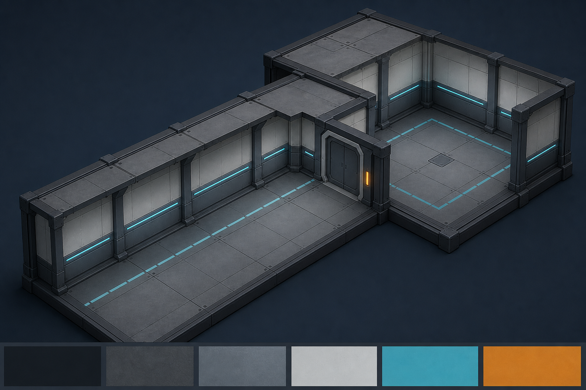

# Planche d'assemblage — kit modulaire structurel V1

## Référence visuelle

Cette image est une référence de conception générée pour le lot, approuvée par l'utilisateur le 2026-07-26. Elle définit l'intention d'assemblage, pas un asset final, une texture source ou une géométrie à importer.

## Assemblage de validation laboratoire

| Vignette | Dimensions internes | Modules requis | Résultat attendu |
|---|---:|---|---|
| Couloir | 6 × 12 × 3,50 m | 18 × sol 01, 12 × mur 05, 18 × plafond 10, 8 × pilier 20, 6 × poutre 21, couvre-joints 22/23 | Travées régulières de 2 m, joints non visibles en vue FPS, plafond continu. |
| Angle | 6 × 6 × 3,50 m | sols 02/03, murs 07/08, plafonds 10, piliers 20 | Virage lisible sans fuite, sans chevauchement ni perte de guidage au sol. |
| Petite salle | 8 × 8 × 3,50 m | sols 01/03, murs 05/06/09, plafonds 10/11, piliers, poutres et couvre-joints | Volume fermé et sobre, lisible à moyenne distance avec une silhouette ennemie témoin. |
| Porte | baie 4 × 3,50 m | encadrement 13, un panneau 15 à 19, sols 01/04, murs 05 | Panneau centré dans la baie, cadre distinct du mur, aucun conflit visuel avec le volume de porte piloté par le jeu. |

## Scénario de contrôle

1. Déposer les copies `.glb` dans `DESIGN/laboratoire/imports/`.
2. Lancer `python run_labo.py` et contrôler chaque module à l'échelle `1,00`.
3. Vérifier les quatre vignettes sous les ambiances froide, neutre et alerte.
4. Refuser le lot si une face manque, si un jour ou un chevauchement apparaît, ou si la porte est ambiguë en vue FPS.
5. Reporter les observations asset par asset dans le bordereau de transmission, sans déclarer la validation fonctionnelle du jeu.
